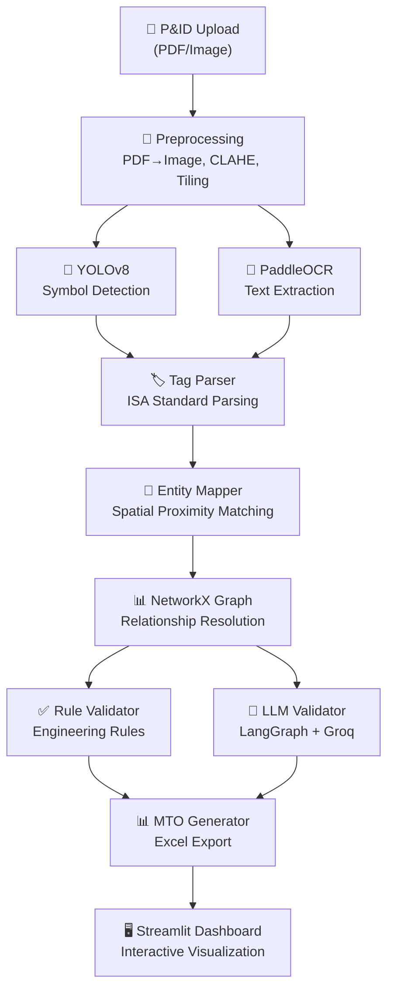
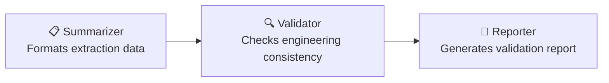

# 🏗️ P&ID Document Intelligence & MTO Extraction Pipeline

**An end-to-end AI system that automatically extracts Material Take-Off (MTO) data from P&ID (Piping & Instrumentation Diagram) engineering drawings using Computer Vision, OCR, Graph-based reasoning, and LLM validation.**


---

## 🎯 Problem Statement

In EPC (Engineering, Procurement, Construction) projects, extracting Material Take-Off data from P&ID drawings is a **manual, time-consuming, and error-prone process**. Engineers spend hours identifying valves, instruments, equipment, and piping components from complex drawings and tabulating them into MTO spreadsheets.

This project **automates the entire process** using AI/ML:

```
📄 P&ID Drawing → 🎯 Symbol Detection → 📝 OCR Text Extraction → 🔗 Graph Mapping → 🤖 AI Validation → 📊 MTO Excel
```

---

## 🏗️ Architecture



---

## ✨ Key Features

| Feature | Technology | Description |
|---------|-----------|-------------|
| **Symbol Detection** | YOLOv8s | Detects valves, instruments, equipment, piping components |
| **Text Extraction** | PaddleOCR | Extracts instrument tags, line numbers, equipment labels |
| **Tag Parsing** | Regex + ISA Standards | Parses `FV-101`, `PI-202`, `6"-PA-1001` into structured data |
| **Entity Mapping** | Spatial Proximity | Associates symbols with their nearest text labels |
| **Graph Reasoning** | NetworkX | Builds relationship graph, resolves connections |
| **Rule Validation** | Deterministic Rules | Checks tag uniqueness, loop integrity, valve connections |
| **AI Validation** | LangGraph + Groq (Llama 3.3 70B) | 3-node agent: Summarize → Validate → Report |
| **MTO Generation** | openpyxl | Professional Excel with categories, formatting, auto-filters |
| **Web Dashboard** | Streamlit | Interactive UI with detection overlay, graph viz, MTO table |
| **REST API** | FastAPI | Upload → Process → Download endpoints |

---

## 🚀 Quick Start

### 1. Clone & Install

```bash
git clone https://github.com/Venkateswara-Sahu/pid-mto-extraction.git
cd pid-mto-extraction

# Create virtual environment
python -m venv venv
venv\Scripts\activate  # Windows

# Install dependencies
pip install -r requirements.txt
```

### 2. Configure Environment

```bash
copy .env.example .env
# Edit .env and add your Groq API key (free from console.groq.com)
```

### 3. Run the Dashboard

```bash
streamlit run app/streamlit_app.py
```

### 4. (Optional) Train Custom YOLOv8 Model

Open `notebooks/01_yolo_training.ipynb` in Google Colab. Dataset options:
- **Roboflow** "P&ID Object Detection AI Ready" (7.1k+ images) — requires free Roboflow account
- **Hugging Face** "Digitize-PID" (500 images) — no account needed

---

## 📂 Project Structure

```
pid-mto-extraction/
├── config/
│   └── settings.py              # Centralized Pydantic configuration
├── src/
│   ├── preprocessing/
│   │   ├── pdf_converter.py     # PDF → high-res images (PyMuPDF)
│   │   ├── image_tiler.py       # Tile large drawings for detection
│   │   └── enhancer.py          # CLAHE, denoise, binarize
│   ├── detection/
│   │   ├── symbol_detector.py   # YOLOv8 inference wrapper
│   │   └── postprocessor.py     # Merge tiles + NMS deduplication
│   ├── ocr/
│   │   ├── text_extractor.py    # PaddleOCR text extraction
│   │   └── tag_parser.py        # ISA standard tag parsing
│   ├── graph/
│   │   ├── entity_mapper.py     # Symbol-text spatial association
│   │   ├── graph_builder.py     # NetworkX graph construction
│   │   └── relationship_resolver.py  # Line assignment, loop detection
│   ├── validation/
│   │   ├── engineering_rules.py # 6 deterministic validation rules
│   │   ├── confidence_scorer.py # Weighted extraction confidence
│   │   └── llm_validator.py     # 3-node LangGraph agent (Groq)
│   ├── mto/
│   │   ├── mto_generator.py     # Excel MTO generation
│   │   └── templates.py         # Column & style definitions
│   └── pipeline.py              # Full pipeline orchestrator
├── app/
│   ├── api.py                   # FastAPI REST backend
│   └── streamlit_app.py         # Streamlit dashboard
├── notebooks/
│   └── 01_yolo_training.ipynb   # Google Colab training notebook
├── models/                      # Trained YOLOv8 weights
├── data/
│   ├── sample_pids/             # Sample P&ID images
│   └── output/                  # Generated MTO files
└── requirements.txt
```

---

## 🤖 LLM Validation Agent (LangGraph)

The validation pipeline uses a **3-node LangGraph agent** powered by **Groq (Llama 3.3 70B)**:



**Validation rules include:**
- `R001`: Tag completeness — every instrument/equipment should have a tag
- `R002`: Tag uniqueness — no duplicate tag IDs
- `R003`: Instrument loop integrity — measurement + control elements
- `R004`: Low confidence flagging — entities needing human review
- `R005`: Orphan node detection — isolated components
- `R006`: Valve connection check — inlet + outlet requirements

---

## 🛠️ Tech Stack

| Layer | Technology | Purpose |
|-------|-----------|---------|
| **Detection** | YOLOv8 (Ultralytics) | Engineering symbol detection |
| **OCR** | PaddleOCR / EasyOCR | Text extraction from drawings |
| **CV** | OpenCV | Image preprocessing & tiling |
| **Graph** | NetworkX | Entity relationship modeling |
| **LLM** | Groq (Llama 3.3 70B) | AI-powered validation |
| **Agents** | LangGraph | Multi-node validation pipeline |
| **Backend** | FastAPI | REST API |
| **Frontend** | Streamlit | Interactive dashboard |
| **Output** | openpyxl + pandas | MTO Excel generation |
| **Config** | Pydantic Settings | Type-safe configuration |

---

## 📊 Sample Output

### MTO Excel
The generated MTO includes:
- Items grouped by category (Equipment, Valves, Instruments, Piping)
- Tag numbers, descriptions, sizes, specifications
- Line number associations
- Extraction confidence scores
- Low-confidence items highlighted for review

### Graph Visualization
Interactive NetworkX graph showing:
- 🟢 Valves | 🟠 Instruments | 🔴 Equipment | 🔵 Piping
- Piping connections and signal paths
- Instrument loop groupings

---

## 📝 License

This project is built for educational and portfolio purposes.

---

## 👨‍💻 Author

**Venkateswara Sahu**
- GitHub: [Venkateswara-Sahu](https://github.com/Venkateswara-Sahu)
- LinkedIn: [venkateswara-sahu](https://linkedin.com/in/venkateswara-sahu)
- Email: venkateswarasahu000@gmail.com
