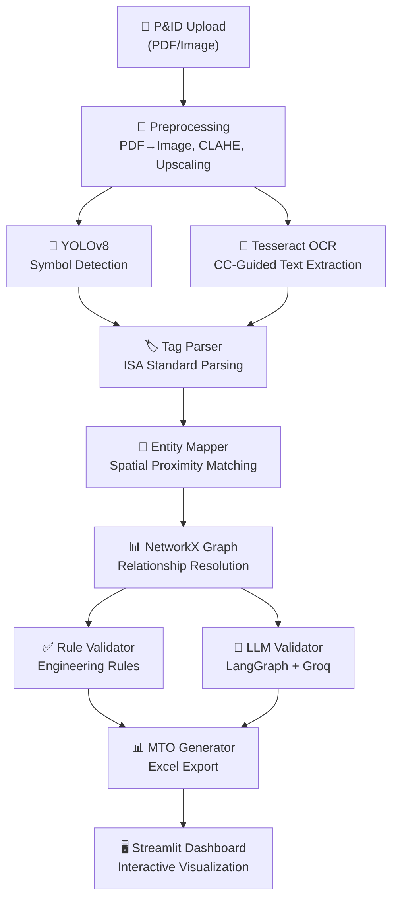
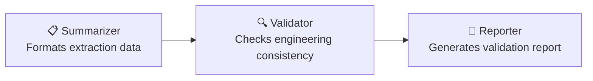

# 🏗️ P&ID Document Intelligence & MTO Extraction Pipeline

**An end-to-end AI system that automatically extracts Material Take-Off (MTO) data from P&ID (Piping & Instrumentation Diagram) engineering drawings using Computer Vision, OCR, Graph-based reasoning, and LLM validation.**


---

## 🎯 Problem Statement

In EPC (Engineering, Procurement, Construction) projects, extracting Material Take-Off data from P&ID drawings is a **manual, time-consuming, and error-prone process**. Engineers spend hours identifying valves, instruments, equipment, and piping components from complex drawings and tabulating them into MTO spreadsheets.

This project **automates the entire process** using AI/ML:

```
📄 P&ID Drawing → 🎯 Symbol Detection → 📝 OCR Text Extraction → 🔗 Graph Mapping → 🤖 AI Validation → 📊 MTO Excel
```

---

## 🏗️ Architecture



---

## ✨ Key Features

| Feature | Technology | Description |
|---------|-----------|-------------|
| **Symbol Detection** | YOLOv8s (custom-trained) | Detects valves, instruments, equipment, piping components |
| **Text Extraction** | Tesseract OCR + Connected-Component Analysis | CC-guided OCR finds text-like blobs first, then OCR reads only those regions — avoids pipe-line noise |
| **Tag Parsing** | Regex + ISA-5.1 Standards | Parses `FV-101`, `PI-202`, `6"-PA-1001` into structured data with OCR correction heuristics |
| **Entity Mapping** | Spatial Proximity | Associates detected symbols with their nearest text labels |
| **Graph Reasoning** | NetworkX | Builds relationship graph, resolves piping connections and instrument loops |
| **Rule Validation** | Deterministic Rules | Checks tag uniqueness, loop integrity, valve connections |
| **AI Validation** | LangGraph + Groq (Llama 3.3 70B) | 3-node agent: Summarize → Validate → Report |
| **MTO Generation** | openpyxl | Professional Excel with categories, formatting, confidence scores |
| **Web Dashboard** | Streamlit | Upload, detect, visualize graph, download MTO — all in one UI |
| **REST API** | FastAPI | Upload → Process → Download endpoints |

---

## 🚀 Quick Start

### Prerequisites

- Python 3.10+
- [Tesseract OCR 5.x](https://github.com/UB-Mannheim/tesseract/wiki) installed (Windows: `winget install UB-Mannheim.TesseractOCR`)
- (Optional) Groq API key for LLM validation — free at [console.groq.com](https://console.groq.com)

### 1. Clone & Install

```bash
git clone https://github.com/Venkateswara-Sahu/P-ID-Processing-MTO-Extraction-System.git
cd P-ID-Processing-MTO-Extraction-System

# Create virtual environment
python -m venv venv
venv\Scripts\activate        # Windows
# source venv/bin/activate   # Linux/macOS

# Install dependencies
pip install -r requirements.txt
```

### 2. Install Tesseract OCR

**Windows (recommended):**
```bash
winget install --id UB-Mannheim.TesseractOCR -e
```
Or download from: https://github.com/UB-Mannheim/tesseract/wiki

**Linux:**
```bash
sudo apt install tesseract-ocr
```

### 3. Configure Environment

```bash
copy .env.example .env   # Windows
# cp .env.example .env   # Linux/macOS

# Edit .env — add your Groq API key if you want LLM validation
# GROQ_API_KEY=gsk_your_key_here   (optional — pipeline works without it)
```

### 4. Add Your YOLOv8 Model

Place your trained weights at `models/best.pt`.

> **Training your own model:** Open `notebooks/01_yolo_training.ipynb` in Google Colab.  
> Dataset: [Roboflow P&ID Object Detection](https://roboflow.com) — requires a free Roboflow account.

### 5. Run the Dashboard

```bash
streamlit run app/streamlit_app.py
```

Open **http://localhost:8501** → Upload a P&ID image or PDF → Click **Extract MTO**.

---

## 📂 Project Structure

```
P-ID-Processing-MTO-Extraction-System/
├── config/
│   └── settings.py              # Pydantic-Settings configuration
├── src/
│   ├── preprocessing/
│   │   ├── pdf_converter.py     # PDF → high-res images (PyMuPDF)
│   │   ├── image_tiler.py       # Tile large drawings for detection
│   │   └── enhancer.py          # CLAHE, denoise, upscaling
│   ├── detection/
│   │   ├── symbol_detector.py   # YOLOv8 inference wrapper
│   │   └── postprocessor.py     # Merge tiles + NMS deduplication
│   ├── ocr/
│   │   ├── text_extractor.py    # CC-guided Tesseract OCR engine
│   │   └── tag_parser.py        # ISA-5.1 tag parsing + OCR correction
│   ├── graph/
│   │   ├── entity_mapper.py     # Symbol-text spatial association
│   │   ├── graph_builder.py     # NetworkX graph construction
│   │   └── relationship_resolver.py  # Line assignment, loop detection
│   ├── validation/
│   │   ├── engineering_rules.py # Deterministic validation rules
│   │   ├── confidence_scorer.py # Weighted extraction confidence
│   │   └── llm_validator.py     # 3-node LangGraph agent (Groq)
│   ├── mto/
│   │   ├── mto_generator.py     # Excel MTO generation
│   │   └── templates.py         # Column & style definitions
│   └── pipeline.py              # Full pipeline orchestrator
├── app/
│   ├── api.py                   # FastAPI REST backend
│   └── streamlit_app.py         # Streamlit dashboard
├── notebooks/
│   └── 01_yolo_training.ipynb   # Google Colab training notebook
├── models/                      # Place trained YOLOv8 weights here (best.pt)
├── data/
│   ├── sample_pids/             # Sample P&ID images for testing
│   └── output/                  # Generated MTO files (git-ignored)
├── .env.example                 # Environment variable template
└── requirements.txt
```

---

## 🔍 OCR Engine: Connected-Component Guided Tesseract

A key innovation of this pipeline is how it handles OCR on complex P&ID drawings. Standard full-image OCR fails because pipe lines, valve symbols, and equipment graphics create character-like shapes that overwhelm OCR engines.

**Our approach:**
1. **Binarize** the image with dual-threshold (fixed + adaptive) to make text clearly black on white
2. **Find text-like blobs** using connected-component statistics: height 12–130px, aspect ratio 0.15–12, fill ratio 0.08–0.90
3. **Group blobs** into word-level regions (merges `E`, `-`, `1001` into one group)
4. **Build an overlap mask** from these CC regions
5. **Run ONE Tesseract psm-11 call** on the full image
6. **Filter Tesseract's results** to only words overlapping the CC mask
7. **Post-process**: merge fragments, apply OCR correction heuristics (`Re1001` → `R-1001`)

This runs in **~7 seconds** vs. ~360 seconds for per-crop approaches.

---

## 🤖 LLM Validation Agent (LangGraph + Groq)

The validation pipeline uses a **3-node LangGraph agent** powered by **Groq (Llama 3.3 70B)** — only runs if `GROQ_API_KEY` is set:



**Engineering validation rules:**
- `R001`: Tag completeness — every detected symbol should have a tag
- `R002`: Tag uniqueness — no duplicate tag IDs  
- `R003`: Instrument loop integrity — measurement + control elements
- `R004`: Low confidence flagging — entities needing human review
- `R005`: Orphan node detection — isolated components
- `R006`: Valve connection check — inlet + outlet requirements

---

## 🛠️ Tech Stack

| Layer | Technology | Version |
|-------|-----------|---------|
| **Detection** | YOLOv8 (Ultralytics) | ≥8.2 |
| **OCR** | Tesseract + pytesseract | 5.4 / ≥0.3.10 |
| **OCR Fallback** | EasyOCR | ≥1.7 |
| **CV** | OpenCV | ≥4.9 |
| **Graph** | NetworkX | ≥3.2 |
| **LLM** | Groq (Llama 3.3 70B) | — |
| **Agents** | LangGraph | ≥0.2 |
| **Backend** | FastAPI | ≥0.110 |
| **Frontend** | Streamlit | ≥1.35 |
| **Output** | openpyxl + pandas | ≥3.1 / ≥2.1 |
| **Config** | Pydantic Settings | ≥2.1 |

---

## 📊 Sample Output

### Streamlit Dashboard
- Upload P&ID → real-time progress → annotated image overlay
- Interactive PyVis entity relationship graph
- Tabular MTO with confidence scores
- One-click Excel + JSON + annotated image download

### MTO Excel
Items grouped by category (Equipment, Valves, Instruments, Piping, Other):

| Item | Tag Number | Description | Type | Size | Confidence |
|------|------------|-------------|------|------|-----------|
| 1 | E-1001 | Heat Exchanger | Equipment | — | 82% |
| 2 | P-1001A/B | Centrifugal Pump | Equipment | — | 78% |
| 3 | Gate_Valve | Gate Valve | Valve | 4" | 71% |

---

## ⚠️ Current Limitations

- **YOLO model accuracy** depends on the P&ID symbol style it was trained on. The included training notebook uses a publicly available Roboflow dataset. Re-train on your own drawings for best results.
- **OCR accuracy** on very small or overlapping labels may be limited without a higher-resolution scan.
- **LLM validation** requires a free Groq API key (`GROQ_API_KEY` in `.env`). Without it, only rule-based validation runs.

---

## 📝 License

This project is built for educational and portfolio purposes. MIT License.

---

## 👨‍💻 Author

**Venkateswara Sahu**
- GitHub: [Venkateswara-Sahu](https://github.com/Venkateswara-Sahu)
- LinkedIn: [venkateswara-sahu](https://linkedin.com/in/venkateswara-sahu)
- Email: venkateswarasahu000@gmail.com
